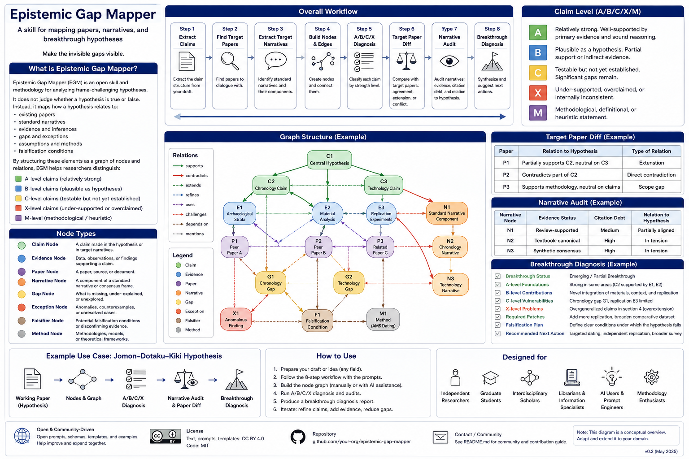

# Epistemic Gap Mapper Skill

**Epistemic Gap Mapper** is a prompt-and-schema based skill for analyzing *frame-challenging hypotheses*.

It is a structure-diagnosis tool, not a truth judge, ranking system, or automatic reviewer.

It does **not** decide whether a hypothesis is true. Instead, it maps how a new hypothesis relates to:

- target papers,
- target narratives,
- evidence,
- assumptions,
- gaps,
- exceptions,
- overclaims,
- and falsification conditions.

The goal is to turn a fragile or outsider hypothesis into a structure that specialists can actually inspect.

> It does not replace expertise. It makes outsider hypotheses legible to expertise.



## Core idea

Most review systems ask whether a manuscript fits an existing disciplinary frame. Epistemic Gap Mapper asks a different question:

> Where exactly does this hypothesis inherit from existing papers, where does it challenge a diffuse narrative, and where does it overreach?

The system separates:

- **Paper conflict**: disagreement with a specific source.
- **Narrative conflict**: disagreement with a standard story that may not be traceable to one strong paper.
- **Narrative trace**: a candidate source's direct, partial, or merely compatible relationship to a narrative.
- **Scope gap**: something target papers do not address.
- **Frame conflict**: a different interpretation of accepted evidence.
- **Overclaim**: a claim stronger than its evidence.

## Main workflow

1. **Input**
   - User manuscript / hypothesis.
   - Target papers.
   - Target narratives.

2. **Node extraction**
   - Extract Claim, Evidence, Paper, Narrative, Gap, Exception, Falsifier, and Method nodes.

3. **Calibration audit**
   - Run an LLM structural audit.
   - Let a human author, expert, or reviewer declare final A/B/C/X/M tiers.
   - Locally check each declared claim-evidence pair.
   - Mark comparisons as heuristic analogies, not evidence.
   - Hand off graph findings for human global review.

4. **Cross-frame diagnosis**
   - Check logic, source validity, paper relations, narrative debt, and unexplained exceptions.

5. **Output**
   - Node graph.
   - Inline manuscript annotations.
   - Breakthrough Diagnosis.
   - Narrative Audit.

## A/B/C/X/M claim tiers

Tiers are declarations, not automated truth judgments. The LLM can propose candidate tiers and audit consistency, but final tiers should record who declared them.

| Tier | Meaning |
|---|---|
| A | Relatively strong claim supported by existing data or scholarship. |
| B | Plausible hypothesis consistent with current evidence but not proven. |
| C | Not yet assertable, but testable or worth preserving as a research question. |
| X | Unsupported, overclaimed, internally inconsistent, or contradicted by evidence. |
| M | Methodological tag or heuristic analogy, not direct evidence. |

X-tier nodes also record `failure_modes`: `evidence_laundering`, `analogy_inflation`, `narrative_capture`, `falsifier_removal`, `citation_debt`, or `scope_jump`. This makes "X" a structural diagnosis rather than a single dismissal label.

## Recommended use

This skill is useful when a researcher, independent scholar, journalist, graduate student, or interdisciplinary team has a bold hypothesis and needs to know:

- which claims are actually supported,
- which claims are merely plausible,
- which claims must be weakened,
- which standard narrative is being challenged,
- and what evidence would falsify the hypothesis.

## First 10 Minutes

If the full worked example feels too large, start here:

- `examples/starter_cafe_rain/` — a small everyday example asking whether rainy days increase neighborhood cafe sales.
- `templates/first_map_template.md` — a paper-before-the-paper worksheet.
- `templates/nodes_template.json` — a copyable starter node graph.
- `templates/graph_template.md` — a copyable Mermaid graph skeleton.

The starter example is intentionally ordinary. It teaches the basic move: map a claim, the source data, the default narrative, the overclaim risk, and the falsifier before arguing about conclusions.

## Jomon / Dotaku / Kiki Worked Examples

The `examples/jomon_dotaku_kiki/` folder contains two levels of node examples:

- `nodes_minimal.json` — a compact readable graph for learning the node system.
- `nodes_full.json` — a fuller graph covering major claims from the working paper, including paternal-lineage asymmetry, dotaku discontinuity, Kiki mythic structures, continental background, heuristic comparison, risks, and falsifiers.
- `graph_sample_grouped.md` — a Mermaid graph with subgraphs for genetics, archaeology, mythology, continental background, narrative audit, comparative methods, and falsification.

The `prose_case/` folder shows how the same broad hypothesis can be written in formal prose and then decomposed back into nodes:

- `prose_case/prose_only_working_paper_sample.md`
- `prose_case/node_decomposition_walkthrough.md`

## Repository contents

- `SKILL.md` — Codex skill instructions and trigger metadata.
- `agents/openai.yaml` — UI metadata for skill lists and default invocation.
- `CODEX_TASK.md` — maintenance guidance for Codex-assisted improvements.
- `README.md` and `QUICKSTART.md` — public overview and usage flow.
- `CONTRIBUTING.md` — contribution rules and safety expectations.
- `CITATION.cff` — citation metadata.
- `docs/` — conceptual design, workflow, node schema, edge schema, failure modes, methodological index, and tool falsifiability.
- `prompts/` — copy-paste prompts for each step of the workflow.
- `schemas/` — JSON schemas for nodes, edges, graphs, and reports.
- `templates/` — reusable intake, graph, node, and report templates.
- `examples/` — starter and advanced worked examples.
- `outreach/` — public explainers and recruitment/community posts in English and Japanese.
- `scripts/` — lightweight local graph validation and Mermaid rendering helper.
- `.github/` — issue templates and the `.github/workflows/validate-samples.yml` sample validation workflow.
- `assets/` — diagram and visual materials.

## License

Text, prompts, templates, and diagrams are intended for release under **CC BY 4.0 International** unless otherwise stated.

Executable helper scripts are intended for release under the **MIT License**. Text assets are intended for **CC BY 4.0**.

- Root `LICENSE`: CC BY 4.0 notice for the primary text/prompt/schema skill materials.
- Text, prompts, templates, documentation, examples, schemas, outreach materials, and diagrams: see `LICENSE-CC-BY-4.0.md`.
- Code in `scripts/`: see `LICENSE-MIT.md`.

## Validation

```bash
python scripts/egm_cli.py validate examples/starter_cafe_rain/nodes_starter.json
python scripts/egm_cli.py validate examples/jomon_dotaku_kiki/nodes_minimal.json
python scripts/egm_cli.py validate examples/jomon_dotaku_kiki/nodes_full.json
python scripts/egm_cli.py render examples/jomon_dotaku_kiki/nodes_full.json --mermaid
```

## v0.2 Additions

This package now includes outward-facing explanation and recruitment materials in `outreach/`, plus a prose-only case study for the Jomon / Dotaku / Kiki hypothesis in `examples/jomon_dotaku_kiki/prose_case/`.

The prose case is included because some preprint servers and scholarly venues reject bullet-heavy working papers as insufficiently formal or AI-like. The sample demonstrates how the same hypothesis can be written in complete formal prose, while the node decomposition walkthrough demonstrates how Epistemic Gap Mapper can recover the underlying claim structure afterward.
