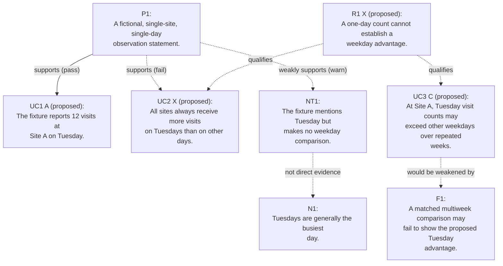

# Mermaid Graph

Generated from `nodes_calibration.json` using `scripts/egm_cli.py render`. Edit the JSON and regenerate the diagram together.

## Legend

| Relation | Meaning |
|---|---|
| `supports` | Proposed supporting relation; its local check status is shown separately. |
| `supports_weakly` | Proposed partial or non-decisive support, not proof. |
| `challenges_narrative` | Challenges or reframes a narrative, not necessarily a paper. |
| `qualifies` | Limits how strongly the target may be stated. |
| `falsified_by` | Claim points to a condition that would weaken it; the result has not necessarily occurred. |
| `heuristic_analogy_for` | Analogy or comparison, not evidence. |

Solid support arrows indicate a recorded local `pass`, not global truth. Dotted arrows indicate pending or non-passing support, limits, future falsifiers, or non-evidentiary relations. Read each label: dotted does not mean false. `proposed` tiers are not human declarations; `needs_source` means the local source check is pending.

