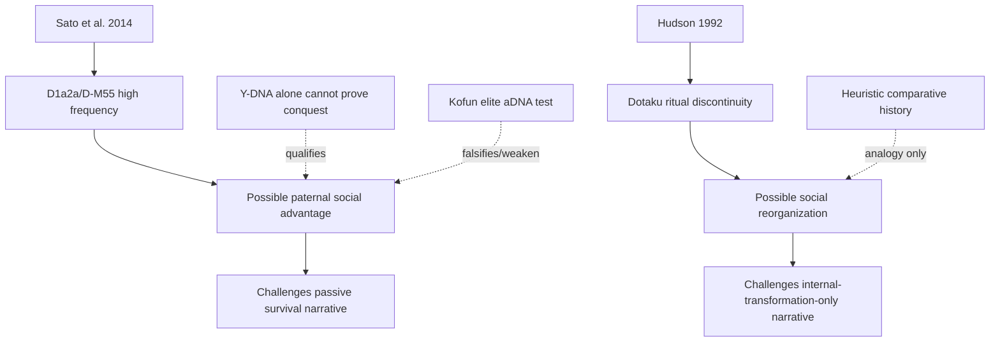

# Sample Mermaid Graph

```mermaid
graph TD
  P1[Sato et al. 2014] --> E1[D1a2a/D-M55 high frequency]
  E1 --> UC1[Possible paternal social advantage]
  UC1 --> N2[Challenges passive survival narrative]
  R1[Y-DNA alone cannot prove conquest] -. qualifies .-> UC1
  F1[Kofun elite aDNA test] -. falsifies/weaken .-> UC1

  P2[Hudson 1992] --> E2[Dotaku ritual discontinuity]
  E2 --> UC2[Possible social reorganization]
  UC2 --> N3[Challenges internal-transformation-only narrative]
  M7[Heuristic comparative history] -. analogy only .-> UC2
```
