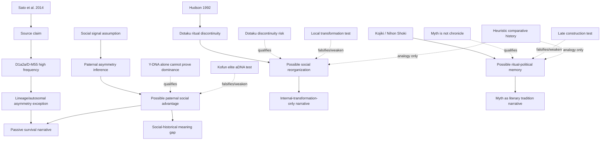

# Sample Mermaid Graph

```mermaid
graph TD
  P1[Sato et al. 2014] --> SC1[Source claim]
  SC1 --> E1[D1a2a/D-M55 high frequency]
  E1 --> EX1[Lineage/autosomal asymmetry exception]
  EX1 --> N2[Passive survival narrative]
  A1[Social signal assumption] --> I1[Paternal asymmetry inference]
  I1 --> UC1[Possible paternal social advantage]
  UC1 --> G1[Social-historical meaning gap]
  UC1 --> N2
  R1[Y-DNA alone cannot prove dominance] -. qualifies .-> UC1
  F1[Kofun elite aDNA test] -. falsifies/weaken .-> UC1

  P2[Hudson 1992] --> E2[Dotaku ritual discontinuity]
  E2 --> UC2[Possible social reorganization]
  UC2 --> N3[Internal-transformation-only narrative]
  R2[Dotaku discontinuity risk] -. qualifies .-> UC2
  F2[Local transformation test] -. falsifies/weaken .-> UC2

  P3[Kojiki / Nihon Shoki] --> UC3[Possible ritual-political memory]
  UC3 --> N4[Myth as literary tradition narrative]
  R3[Myth is not chronicle] -. qualifies .-> UC3
  F3[Late construction test] -. falsifies/weaken .-> UC3
  M7[Heuristic comparative history] -. analogy only .-> UC2
  M7 -. analogy only .-> UC3
```
