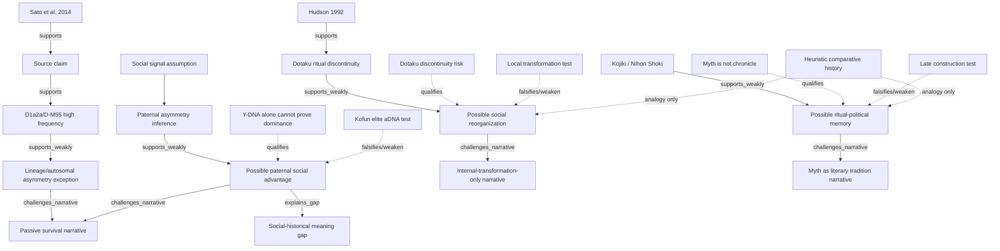

# Sample Mermaid Graph

## Legend

| Relation | Meaning | Usual arrow style |
|---|---|---|
| `supports` | A source, source claim, or evidence node directly supports another node. | Solid arrow |
| `supports_weakly` | A node is consistent with or partially supports another node, but does not prove it. | Solid arrow, preferably labeled |
| `challenges_narrative` | A claim, exception, or model challenges or reframes a `NarrativeNode`. | Solid labeled arrow |
| `qualifies` | A risk or limitation constrains how strongly a claim may be stated. | Dotted arrow |
| `falsified_by` | A falsifier identifies evidence that would weaken a claim. | Dotted arrow |
| `heuristic_analogy_for` | A method or comparison supplies a possibility structure, not direct evidence. | Dotted arrow |

Solid arrows indicate evidentiary or inferential structure. Dotted arrows indicate limits, falsifiers, or heuristic/methodological relations.

