# Grouped Mermaid Graph Sample

This grouped graph is designed for the fuller Jomon / Dotaku / Kiki case.
It keeps genetics, archaeology, mythology, continental background, narrative audit,
comparative methods, and falsification / risk visible as separate subgraphs.

```mermaid
graph TD
  subgraph Genetics [Genetics]
    P1[Sato / Inoue & Sato] -- supports --> SC1[Source claim: Y-lineage variation]
    SC1 -- supports --> E1[D1a2a/D-M55 high frequency]
    P2[Cooke / Liu] -- supports --> SC2[Source claim: updated ancestry models]
    SC2 -- supports --> E2[Autosomal ancestry models]
    E1 -- supports_weakly --> E3[Paternal/autosomal asymmetry]
    E2 -- supports_weakly --> E3
    E3 -- supports_weakly --> I1[Paternal asymmetry inference]
    A1[Assumption: Y-lines may preserve social signal] -- depends_on --> I1
    I1 -- supports_weakly --> UC1[Possible paternal social advantage]
  end

  subgraph Archaeology [Archaeology]
    P3[Hudson 1992] -- supports --> E4[Dotaku discontinuity]
    P4[Mabuchi & Hirao] -- supports --> E5[External bronze-source networks]
    E4 -- supports_weakly --> I2[Social reorganization inference]
    E5 -- supports_weakly --> I2
    A2[Assumption: ritual discontinuity may signal reorganization] -- depends_on --> I2
    I2 -- supports_weakly --> UC2[Possible network disruption / ritual transfer]
  end

  subgraph Mythology [Mythology]
    P5[Kojiki / Nihon Shoki] -- supports --> E6[Descent, land transfer, Ogetsuhime motifs]
    E6 -- supports_weakly --> I3[Myth-as-social-memory inference]
    A3[Assumption: myth can preserve transformed memory] -- depends_on --> I3
    I3 -- supports_weakly --> UC3[Possible ritual-political memory]
  end

  subgraph Continental_Background [Continental Background]
    P6[Fang / Liu / Wang] -- supports --> E7[Shandong-Haidai / coastal gene flow]
    P7[Fujio chronology] -- supports --> E8[Yayoi chronology]
    E7 -- supports_weakly --> I4[Continental context inference]
    E8 -- supports_weakly --> I4
    I4 -- supports_weakly --> UC4[Context, not direct cause]
  end

  subgraph Cross_Domain_Model [Cross-Domain Model]
    UC1 -- supports_weakly --> UC5[Integrated abductive model]
    UC2 -- supports_weakly --> UC5
    UC3 -- supports_weakly --> UC5
    UC4 -- supports_weakly --> UC5
    M1[Abductive reasoning] -. not evidence .-> UC5
    M3[Consilience] -. not evidence .-> UC5
    M8[Falsification framing] -. not evidence .-> UC5
  end

  subgraph Narrative_Audit [Narrative Audit]
    N1[Standard overlay narrative]
    N2[Passive survival narrative]
    N3[Internal dotaku transition narrative]
    N4[Myth as literary legitimation narrative]
    N5[Simplified migration narrative]
    NT1[NarrativeTrace: compatible but not direct-only-passive claim]
    P1 -. compatible context .-> NT1
    NT1 -. not direct evidence .-> N2
    UC1 -- challenges_narrative --> N1
    UC1 -- challenges_narrative --> N2
    UC2 -- challenges_narrative --> N3
    UC3 -- challenges_narrative --> N4
    UC4 -- challenges_narrative --> N5
  end

  subgraph Comparative_Methods [Comparative Methods]
    M4[Myth as social memory, not chronicle] -. heuristic_analogy_for .-> UC3
    M6[Kumulipo / oral genealogy analogy] -. heuristic_analogy_for .-> UC3
    M7[Comparative highland/lowland history] -. heuristic_analogy_for .-> UC2
    M7 -. heuristic_analogy_for .-> UC3
  end

  subgraph Falsification_Risk [Falsification / Risk]
    R1[Y-DNA alone cannot prove dominance] -. qualifies .-> UC1
    R2[Dotaku discontinuity cannot prove takeover] -. qualifies .-> UC2
    R3[Myth is not chronicle] -. qualifies .-> UC3
    R4[No direct Shang-Zhou-to-Yayoi causal proof] -. qualifies .-> UC4
    R5[Do not call Dotaku sphere simply immigrant] -. qualifies .-> UC5
    R6[Cross-domain synthesis can over-imply proof] -. qualifies .-> UC5
    F1[Kofun elite aDNA test] -. falsified_by .-> UC1
    F2[Dotaku continuity test] -. falsified_by .-> UC2
    F3[Kiki late-construction test] -. falsified_by .-> UC3
    F4[Ancient DNA source-model test] -. falsified_by .-> UC4
    F5[Neutral demographic model test] -. falsified_by .-> UC1
  end
```

