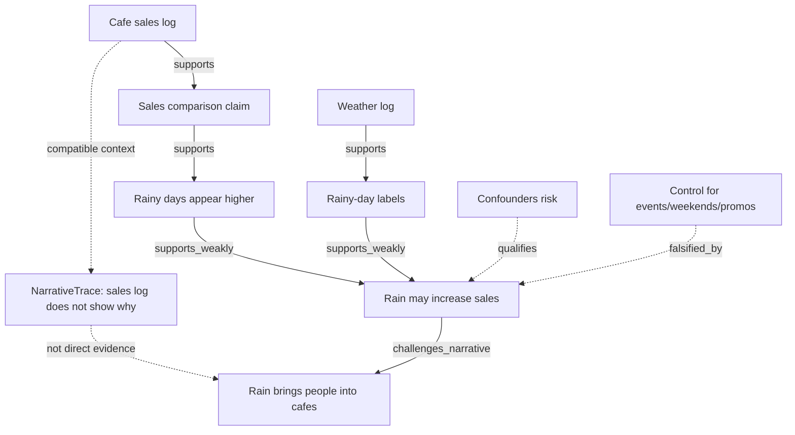

# Starter Mermaid Graph

```mermaid
graph TD
  P1[Cafe sales log] -- supports --> SC1[Sales comparison claim]
  SC1 -- supports --> E1[Rainy days appear higher]
  P2[Weather log] -- supports --> E2[Rainy-day labels]
  E1 -- supports_weakly --> UC1[Rain may increase sales]
  E2 -- supports_weakly --> UC1
  P1 -. compatible context .-> NT1[NarrativeTrace: sales log does not show why]
  NT1 -. not direct evidence .-> N1[Rain brings people into cafes]
  UC1 -- challenges_narrative --> N1
  R1[Confounders risk] -. qualifies .-> UC1
  F1[Control for events/weekends/promos] -. falsified_by .-> UC1
```
