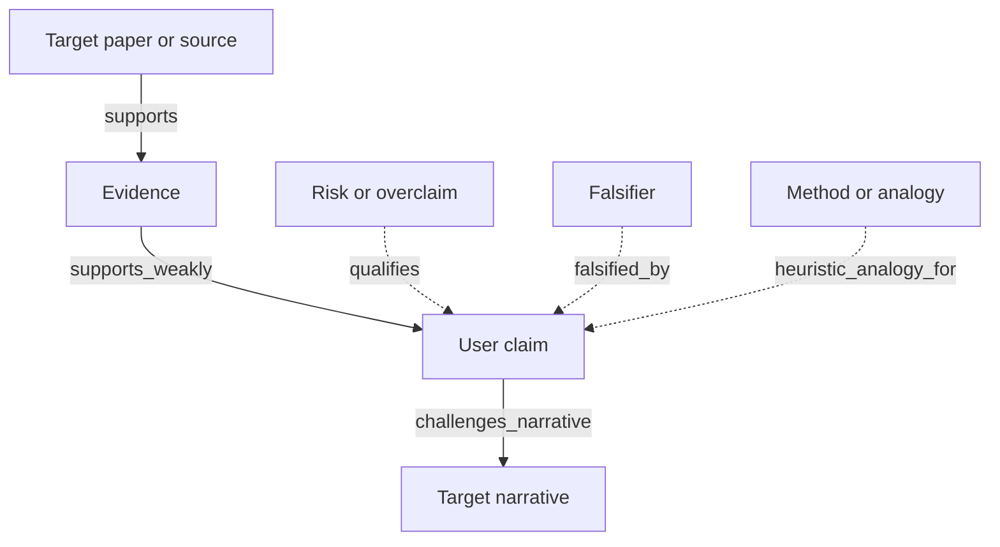

# Graph Template

Copy this Mermaid skeleton and replace the labels.

Solid arrows usually show source, evidence, or inference structure.
Dotted arrows usually show risks, falsifiers, and heuristic or methodological relations.
